# The Deep Learning _Handbook_ 

The Deep Learning _Handbook_ is a project in progress to help study the [Deep Learning **book**](https://www.deeplearningbook.org/) by Goodfellow et al.

Goodfellow's masterpiece is a vibrant and precious resource to introduce the booming topic of deep learning. However, many found the accompanying video lectures, slides, and exercises not pedagogic enough for a fresh starter. 

I used the **'dlbook'** as the primary reference for the machine learning class that I have taught in Spring 2019/2020 at the computer science department, American University of Beirut. 

I would like to share my experience by publishing the slides and some of the assignments on this page. The project may be developed further into a full handbook and guide accompanying the fascinating text of Goodfellow et al. 

The target audience comprises: 
* undergraduate and graduate students willing to know more about machine and deep learning, be able to read research papers or start a graduation project or a master thesis in the same context, 
* developers and practitioners aspiring to a bit more math and philosophy, 
* or mathematicians liking to have some hands-on and a bit more coding experience,
* any other bored or sleepless person.

Currently, only part I and part II are covered. 

## Slides 

### Part I 

* [Introduction](slides/01_intro.pdf)

* [Probability](slides/03_prob.pdf)

* [Numerical Analysis](slides/04_numerical.pdf)

* [Machine Learning Basics](slides/05_ml.pdf)


### Part II

* [Multi-Layer Perceptrons](slides/06_mlp.pdf)

* [Regularization](slides/07_regularization.pdf)

* [Optimization](slides/08_optimization.pdf)

* [Convolutional Neural Networks](slides/09_conv.pdf)

* [Recurrent Neural Networks](slides/10_rnn.pdf)


## Exercises 

### *Assignment 1 - Linear Algebra*

[Linear Algebra Exercises](exercises/Assignment_1_CMPS_392.pdf)

### *Assignment 2 - Numerical Computations*

[Probability Exercises](exercises/Assignment_2_CMPS_392.pdf)

### *Assignment 3 - Numerical Computations*

Notebook: [Numerical Computations](exercises/CMPS_392_Asst_3_Numerical_Computations.ipynb)

---

#### Ex 1 


```python
# Explain 
import numpy as np
a = np.array([0., np.finfo(np.float32).eps/2 ]).astype('float32')
print (a.argmax())
print ( (a+1).argmax() ) 
```

    1
    0


#### Ex 2


```python
# Explain and propose a better solution to compute the variance of the numpy array x 
import numpy.random as rand 
x = np.array([10000 + rand.random() for i in range(10)]).astype('float32')
variance = np.mean(np.power(x,2,dtype='float32'),dtype='float32') - np.power(np.mean(x, dtype='float32'),2,dtype='float32')
print (variance)
stddev = np.sqrt(variance)

np.std(x) 

```

    -8.0


    /usr/local/lib/python3.6/dist-packages/ipykernel_launcher.py:5: RuntimeWarning: invalid value encountered in sqrt
      """


    0.2364306


#### Ex 3


```python

# Take learning rate = 0.18, 0.01, 0.1, 0.2 and explain what's happening when we perform gradient descent 
# Why learning rate = 0.1 performs so nicely at the begining of the descent. Justify. 

import matplotlib.pyplot as plt


A = np.array ([[0.1,0],[0,10]])
theta = np.pi/3
R = np.array ( [[ np.cos(theta), np.sin(theta)] , [-np.sin(theta), np.cos(theta)]] ) 
H = np.matmul ( np.matmul (np.transpose(R), A )  , R )  
print (H) 

x1_vals = np.arange(-200, 200, 1)
x2_vals = np.arange(-200, 200 , 1)

x1, x2 = np.meshgrid(x1_vals , x2_vals)

z = 7.525/2 * x1**2  + 2.575/2 * x2**2 + -4.32 * x1 * x2 +  -9 * x2 + 15

fig = plt.figure(figsize=(10,10))
ax = plt.axes() 
cp = ax.contour(x1, x2, z, [0, 1000, 10000, 100000])
ax.clabel(cp, inline=True, fontsize=10)
ax.set_title('Contour Plot')
ax.set_xlabel('x1 ')
ax.set_ylabel('x2 ')
# ax.set_xlim([-100,-70])
# ax.set_ylim([-200,-150])
# plt.show()

# gradient descent 
x1, x2 = -190, -150
eps = 0.18
pts_x1  = [x1] 
pts_x2 = [x2]


for i in range (100 ): 

  g= np.array ( [(7.525 * x1 -4.32 * x2 ) , (2.575*x2 -4.32 * x1 -9) ])
  gt_h_g = np.dot ( np.dot ( g , H  ) ,  g)
  gt_g = np.dot ( g , g )  
  # print (gt_g/gt_h_g)
  (x1, x2)   =  (x1 - eps * g[0] ,  x2 - eps * g[1] ) 
  pts_x1.append(x1) 
  pts_x2.append(x2)

plt.plot(pts_x1, pts_x2, 'r-x')
plt.show()
```

    [[ 7.525      -4.28682575]
     [-4.28682575  2.575     ]]


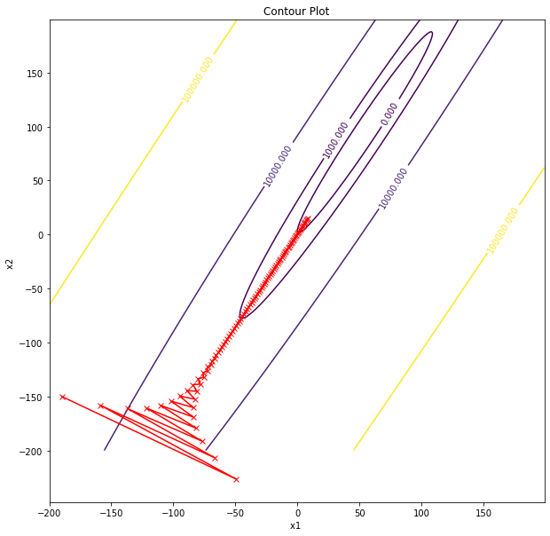


#### Ex 4


```python
# explain what is going wrong, propose a fix 
# n.b. you cannot change the hard coded numbers 

def softmax (x): 
  return np.exp(x)/np.sum(np.exp(x))

def logloss ( probs, y ): 
  return -np.log (np.sum( probs * y))

logits = np.array([89, 50, 60]).astype('float32')
probs = softmax(logits)
y = np.array([1, 0, 0])
loss = logloss ( probs, y )

print (loss)
```

    nan


    /usr/local/lib/python3.6/dist-packages/ipykernel_launcher.py:2: RuntimeWarning: overflow encountered in exp
      
    /usr/local/lib/python3.6/dist-packages/ipykernel_launcher.py:2: RuntimeWarning: invalid value encountered in true_divide
      


#### Ex 5


```python
# explain what is going wrong, propose a fix 

def sigmoid(x): 
  return (1/(1+ np.exp(-x)))

def logloss ( prob, y ): 
  return -np.log (prob * y)

logit = np.float32(-89)
prob = sigmoid(logit)
y = 1
loss = logloss ( prob, y )

print (loss)
```

    inf


    /usr/local/lib/python3.6/dist-packages/ipykernel_launcher.py:4: RuntimeWarning: overflow encountered in exp
      after removing the cwd from sys.path.
    /usr/local/lib/python3.6/dist-packages/ipykernel_launcher.py:7: RuntimeWarning: divide by zero encountered in log
      import sys


#### Ex 6

Propose an example of your choice to show why it is worth keeping an eye on numerical computations issues when implementing machine learning algorithms

### *Assignment 4 - Machine Learning Basics*
Notebook: [Machine Learning Basics](exercises/CMPS_392_Asst_3_Numerical_Computations.ipynb)

---


## Ex 1 
### Unsupervised Learning: K-Means


```python
import random as rand 
NB_PTS = 100 
x1 = [rand.random() for i in range(NB_PTS)]
x2 = [rand.random() for i in range(NB_PTS)]

clustering = [0 for i in range(NB_PTS)] 
print (x1) 
print (x2) 

K = 3
means1 = [rand.random() for i in range(K)]
means2 = [rand.random() for i in range(K)]

def avg(l): 
  return sum(l) / len(l)
```

    [0.9471326642214772, 0.3972056462100213, 0.285162711953281, 0.18190518479532058, 0.5064335792294512, 0.09353411577070236, 0.010696628182872203, 0.8931097678552375, 0.25784095683465713, 0.5639077318959898, 0.5827542015346754, 0.9010111760867971, 0.1476923310138849, 0.8723499400325695, 0.616634424038039, 0.7242207521546677, 0.22946996173079803, 0.0930881009256731, 0.5343419877112755, 0.7685347638910641, 0.5195305278653595, 0.4884761910466756, 0.9682856385716665, 0.015981097805567224, 0.7143355260754944, 0.13458893710239128, 0.18773686359287245, 0.713016149743165, 0.9110159736798663, 0.13289237792047692, 0.6365226865007477, 0.021031828837734023, 0.6125128089797299, 0.540631915895912, 0.5066576361894304, 0.5465751532535325, 0.06269782529086254, 0.45665890532842424, 0.36664735889986466, 0.7704328708523737, 0.21740125428848178, 0.5818376040696764, 0.8427066020620296, 0.41704802121417384, 0.8429715197234855, 0.558649778400369, 0.6485213158128974, 0.983759603612089, 0.6343290410107872, 0.6246584863402533, 0.427200174999224, 0.7757066893147263, 0.3256226874918864, 0.05999929880327992, 0.8745417843207866, 0.15395129475382807, 0.8526247017769161, 0.9869040646474659, 0.9720659986235507, 0.30397101369473, 0.08550841865340386, 0.019213777656657327, 0.2984478649947694, 0.006364278604111817, 0.5020050450046293, 0.35244855550138765, 0.9762784154317948, 0.14131968221849656, 0.36153917070333574, 0.7805562706153217, 0.8670940698633243, 0.575626185025867, 0.21958100235207612, 0.6726895692547454, 0.7676458048745965, 0.6388512802643457, 0.826083080901084, 0.6742079058322269, 0.8724131663599253, 0.023329226203601672, 0.010894871758295288, 0.5461391231383529, 0.5230989200208452, 0.7905476385262615, 0.10298448502554602, 0.06832647414099202, 0.712137417191651, 0.33950908414631886, 0.312101677777855, 0.9904438178013495, 0.36491339366954734, 0.8392685976052635, 0.42805252303879004, 0.410365147519657, 0.13365971790981723, 0.9248021445814629, 0.30823262824986997, 0.25147726705488127, 0.680113571140526, 0.4071743956433034]
    [0.7259169536261615, 0.8425471305247425, 0.2905783342894377, 0.7732252962477899, 0.7333380847633393, 0.7400985555142192, 0.9506137849196897, 0.8892579457528125, 0.8251580931828051, 0.7587973450936715, 0.5446537069914571, 0.9113590904012822, 0.9436109703764602, 0.007625590585367492, 0.8448412406560851, 0.09064741005648713, 0.7005521230144165, 0.8759977072028418, 0.5720269137674371, 0.5065001022740534, 0.7140260414273187, 0.4432200833130354, 0.33136848918711725, 0.9506674400353428, 0.3073937104296688, 0.27930346052938326, 0.35530231771783627, 0.7391329471248553, 0.5932104626222933, 0.9121822031992429, 0.3230057037570926, 0.8250295138967964, 0.06610551918298546, 0.17314280578032115, 0.3964160924374217, 0.17783724245690458, 0.269874357858389, 0.6860564968465733, 0.24549083807426741, 0.7938316508812853, 0.9864374940900938, 0.4746542152712696, 0.9538950765552364, 0.5300847750525473, 0.8476452673029377, 0.7061465246226748, 0.8564097154133025, 0.6028386791460715, 0.0438212040380781, 0.6727649688098377, 0.6072695340720685, 0.01452724752462542, 0.9362172822211361, 0.09234927491444811, 0.45602954980093535, 0.6245664592208706, 0.3598906135557769, 0.722887509032717, 0.8987712165537107, 0.83923931939261, 0.6256126613007423, 0.19764502032917286, 0.8078809964638973, 0.049791103821660965, 0.15869968480509022, 0.8940000206572345, 0.9771797124112325, 0.4937268490172475, 0.8879002747802412, 0.40981237396937564, 0.5968590833156399, 0.08563001312789098, 0.007560655397781502, 0.8978106277269198, 0.2260201424412397, 0.6352314154583115, 0.3720895398742535, 0.9153795480862008, 0.17395204654780871, 0.1491061921035053, 0.35164936707177774, 0.9572097535843327, 0.6689820806127575, 0.7689420440358603, 0.18891344206250915, 0.9521846349231509, 0.035463768621823766, 0.3936690373797652, 0.7110190322463776, 0.01332660529811891, 0.10658124538927749, 0.6403910771963597, 0.05329739340410844, 0.9524485610931087, 0.811776405169049, 0.5888521941911261, 0.4633060047469658, 0.4351535289307512, 0.643206883278922, 0.44218689017516744]


```python
# To plot the points 
 
from bokeh.models import ColumnDataSource, LabelSet
from bokeh.plotting import figure, output_file
from bokeh.io import output_notebook, push_notebook, show
from bokeh.layouts import row, gridplot
import math 


color_list = {0:'red',1:'blue',2:'green'}
family_list = {0:"cluster 0", 1:"cluster 1", 2: "cluster 2"}
marker_list = {0:'x', 1:'o', 2:'square'}

output_notebook()

```


```python

plots = [] 

for it in range(1,10): 
  p = figure(tools="pan,wheel_zoom,reset,save",
          toolbar_location="above",
          title="k-Means iteration: "+str(it))
  for label in range(K): 
    source1 = ColumnDataSource(data=dict( x1=[ x1[i] for i in range(NB_PTS) if clustering[i]==label ], 
                                          x2=[ x2[i]  for i in range(NB_PTS) if clustering[i]==label ] )) 
    p.scatter(x="x1", y="x2", source=source1, size=8, color=color_list[label], marker=marker_list[label], 
              legend_label=family_list[label])
   
    source2 = ColumnDataSource(data=dict( x1= [means1[label]], 
                                            x2= [means2[label]]) )
    p.scatter(x="x1", y="x2", source=source2, size=14, color=color_list[label], marker=marker_list[label])

  p.legend.location = "top_left"
  plots.append(p)

  # (a) assign points to means 
  # WRITE YOUR CODE HERE 
  
  # (b) update means 
  # WRITE YOUR CODE HERE 

show (gridplot(plots, ncols=3) )  

# (c) can you provide an animated visualization to replace the grid of plots ? 
# (d) If the points are uniformly drawn, then it is expected that the sizes of the clusters are almost equal, 
# provide test code to verify this hypothesis
```

## Ex 2 
### Supervised Learning: SVM


```python
import random as rand 
import numpy as np
import matplotlib.pyplot as plt
from sklearn import svm

NB_PTS = 1000 
p1 = [rand.random() * 2 -1 for i in range(NB_PTS)]
p2 = [2 - i  + rand.random() for i in p1] 

n1 = [rand.random() * 2 -1  for i in range(NB_PTS)]
n2 = [-i - rand.random() for i in n1] 

X = list(zip(p1+n1, p2+n2))
Y = [1 for i in range(NB_PTS)] + [-1 for i in range(NB_PTS)]

# (a) what is the analytical solution for the above data using SVM with linear kernel?

clf = svm.SVC(kernel='linear')
clf.fit(X, Y)

# plot the solution 
xx, yy = np.meshgrid(np.arange(-3, 3, 0.01),
                     np.arange(-2, 4, 0.01))

C = np.c_[(xx.ravel(), yy.ravel())]
Z = clf.predict ( C )
Z = Z.reshape(xx.shape)

fig = plt.figure(figsize=(10,10))
ax = plt.axes() 


plt.contourf(xx, yy, Z, alpha=0.5)
ax.set_aspect('equal', 'datalim')
ax.scatter(p1, p2)
ax.scatter(n1, n2)
plt.show()

# (b) Extract the solution params form the clf object

# (c) Extract the support vectors from the clf object, can you change the plot to highlight the support vectors?

# (d) Is is possible to use gradient descent to find the optimal SVM solution? Show how, and provide an implementation for this particular example. 
# hint: Use the Hinge loss function https://en.wikipedia.org/wiki/Hinge_loss
```


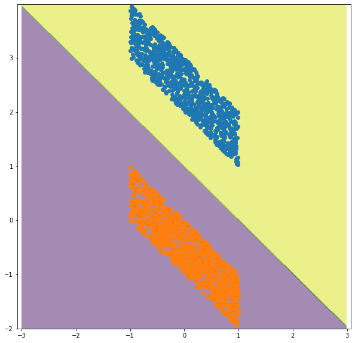


## Ex 3
### Cross-Validation


```python
from sklearn.model_selection import train_test_split
from sklearn import datasets
from sklearn import svm
from sklearn.model_selection import cross_val_score

X, y = datasets.load_iris(return_X_y=True)
X_train, X_test, y_train, y_test = train_test_split(X, y, test_size=0.4, random_state=11)

clf = svm.SVC(kernel='rbf')

# There are two parameters for an RBF kernel: C and γ. It is not known beforehand
# which C and γ are best for a given problem; consequently some kind of model selection
# (hyperparameter search) must be done. The goal is to identify good (C, γ) so that the
# classifier can accurately predict unknown data (i.e. testing data). 
# We recommend a “grid-search” on C and γ using cross-validation. Various pairs
# of (C, γ) values are tried and the one with the best cross-validation accuracy is
# picked. Reference: https://www.csie.ntu.edu.tw/~cjlin/papers/guide/guide.pdf

# (a) Use cross validation on (X_train, y_train) to estimate the best hyperparameters C and gamma for the clf classifier 
# Do a grid search over C = 2^−5, 2^−3, ..., 2^15 and γ = 2^−15, 2^−13, ... , 2^3).

# (b) What are the default C and γ parameters that are picked automatically by the classifer? 
# Do the parameters that you found perform better than the default sklearn parameters?  

# (b) what is the final test score 

clf
```


    SVC(C=1.0, break_ties=False, cache_size=200, class_weight=None, coef0=0.0,
        decision_function_shape='ovr', degree=3, gamma='scale', kernel='rbf',
        max_iter=-1, probability=False, random_state=None, shrinking=True,
        tol=0.001, verbose=False)


## Ex 4
### Bias and Variance for K-NN

Consider K-nearest neighbor regression where the true $y$ is coming from a predefined function $f$ and an unavoidable noise $\epsilon$ of mean $0$ and variance $\sigma$

$$y = f(x) + \epsilon$$

Consider a fixed given point $x_0$ and a sample $x_1, x_2, ..., x_m$. Assume that the values of $x_i$ in the sample are fixed in advance (nonrandom).

We estimate $y_0$ as the value for $x_0$ using the formula: 

$$\hat{y}_0 = \frac{1}{k} \sum_{l=1}^k f(x_l)$$
 
where $x_l$ are the closest $k$ neighbors to $x_0$ (in Euclidean distance sense) 


The bias for K-NN regression is defined as $f(x_0) - \frac{1}{k} \sum_{l=1}^k f(x_l) $

The variance is $\frac{\sigma^2}{k}$ 

The error is $\text{Bias}^2 + \text{Var} + \sigma^2$

Plot the three curves of $\text{Bias}^2$, variance and error. Estimate the best paramameter $k$ for the following example. 


```python
import random as rand 
import matplotlib.pyplot as plt

sigma = 0.2
def f(x1, x2):
  return 2*x1**2 + x2**2 - x1 -x2 - 2 

def avg(l): 
  return sum(l) / len(l)

NB_PTS = 1000

X1 = [ 2*rand.random()-1 for i in range(NB_PTS) ]
X2 = [ 2*rand.random()-1 for i in range(NB_PTS) ]

x01 = 0
x02 = 0

y0 = f(x01, x02) + rand.normalvariate (0, sigma)

X = list ( zip ( X1, X2) )

# we are trying to estimate the value of f at (0,0) as a mean of f at random surrounding points 
fig = plt.figure(figsize=(10,10))
ax = plt.axes() 

xx, yy = np.meshgrid(np.arange(-1.1, 1.1, 0.01),
                     np.arange(-1.1, 1.1, 0.01))

C = np.c_[(xx.ravel(), yy.ravel())]
Z =  np.array([f(*i) for i in C ])
Z = Z.reshape(xx.shape)

cf = ax.contourf(xx, yy, Z, alpha=0.8, origin='lower')

ax.set_aspect('equal')

ax.scatter(X1,X2)
ax.scatter([x01],[x02])
fig.colorbar(cf)
plt.show()


```


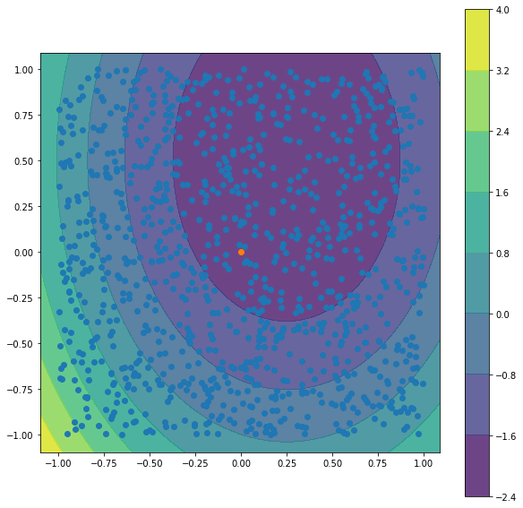


```python
from sklearn.neighbors import NearestNeighbors
import numpy as np

# WRITE YOUR CODE HERE


```


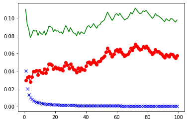


### *Assignment 5 - Multi-layer Perceptrons*
Notebook: [Multi-layer perceptrons](exercises/CMPS_392_Asst_5_Deep_Feed_Forward_Networks.ipynb)

---


### Learning XOR 

Can linear regression solve the XOR problem? 

$\theta = (X^TX)^{-1}(X^Ty)$


```python
import numpy as np 

x = np.array ( [ [1, 0, 1], [0, 1, 1], [0, 0, 1], [1, 1, 1]] ) 
y = np.array ( [1, 1, 0, 0] ) 

# solve using normal equations: 
x_transpose = np.transpose(x)   #calculating transpose
x_transpose_dot_x = x_transpose.dot(x)  # calculating dot product
temp_1 = np.linalg.inv(x_transpose_dot_x) #calculating inverse
temp_2 = x_transpose.dot(y) 
theta = temp_1.dot(temp_2)

theta 
# Result: w = [0,0] b = 0.5 => y = 0.5 everywhere! 
```


    array([0.00000000e+00, 2.22044605e-16, 5.00000000e-01])


```python
# solve using neural network with one hidden layer 

def g(x): 
  return np.maximum(x, 0) # relu 


x = np.array ( [ [1, 0], [0, 1], [0, 0], [1, 1]] )
print(x)
W = np.array ( [[1,1], [1,1]]); 
c = [0, -1]    
w = np.array ( [1, -2] ) 
b = 0      
h = g(x.dot(W)  + c )
print (h) 
y = h.dot(w) + b 
print (y) 

import matplotlib.pyplot as plt
plt.subplot(121)
plt.scatter (x[:,0],x[:,1],c=y) 
plt.subplot(122)
plt.scatter (h[:,0],h[:,1],c=y) 
plt.plot ([0,2],[0,1],'r-')
```

    [[1 0]
     [0 1]
     [0 0]
     [1 1]]
    [[1 0]
     [1 0]
     [0 0]
     [2 1]]
    [1 1 0 0]


    [<matplotlib.lines.Line2D at 0x7ff7b9c6efd0>]


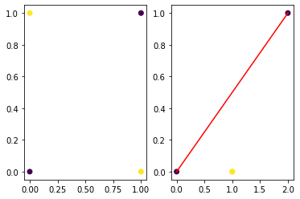


### Ex I 

#### (a) Find W, c, w, b using gradient based learning for the above network. You can use pytorch, tensorflow, keras, or others  
#### (b) have you found the same parameters as for the solution given above?
#### (c) Design neural networks to model an AND gate, OR gate, NAND gate, and make them learn the weigths 


```


```

### Gradient-Based Learning 

In this exercise, we aim at learning the precision of a Conditional Gaussian distribution using a simple neural network 

We fix $x$, and generate values from $N(y, mu, sigma)$

Loss function: 
$-\frac{1}{2} log \beta + \frac{1}{2} \beta (y -\mu)^2 $ 


```python
import numpy as np

import keras.backend as K
def loss(y, beta):
  return  -K.log(beta) + beta * (y - mean)**2 

# build a neural network using keras 
from keras.models import Sequential
from keras.layers import Dense
from keras import optimizers
from keras.initializers import RandomUniform, RandomNormal, Zeros, Ones, Constant

model = Sequential()
# model.add(Dense(1, input_dim=1, activation='relu')) 
model.add(Dense(1, input_dim=1, activation='softplus')) # In addition, we can set kernel_initializer and bias_initializer 

# we want the network to output beta 
# important: if we use RELU, we do not want to start with a 0 gradient since we will get stuck. 
# It is important to inialize w and b (and even x) to not have wx+b < 0 as a start! 
# Another way is to use softplus since it always output a positive value 

model.summary()


```

    Model: "sequential_2"
    _________________________________________________________________
    Layer (type)                 Output Shape              Param #   
    =================================================================
    dense_2 (Dense)              (None, 1)                 2         
    =================================================================
    Total params: 2
    Trainable params: 2
    Non-trainable params: 0
    _________________________________________________________________


```python
import math 
mean = 0
sigma = 1/math.sqrt(5)
# extrem cases to try : 
# -- sigma very large
# sigma = 1000  # precision very small => very large gradients (1/0)
# -- sigma very small 
# sigma = 0.0001 # precision very large 

true_beta= 1.0 / sigma**2 # 1 / 5 = 0.20 

x = np.random.uniform(0,1,1000)
y = np.random.normal(mean, sigma, 1000) 

print (true_beta)

# reinitialize weights
session = K.get_session()
for layer in model.layers: # 1 layer : output layer 
  if hasattr(layer, 'kernel_initializer'):
    layer.kernel.initializer.run(session=session)
  if hasattr(layer, 'bias_initializer'):
    layer.bias.initializer.run(session=session)

model.compile(loss=loss, optimizer=optimizers.sgd(lr=0.01,clipnorm=1)) #clipnorm=1 for beta very small

print ("Weights before learning: ", model.layers[0].get_weights()[0], model.layers[0].get_weights()[1])
history = model.fit(x, y, epochs=300, batch_size=64, verbose=0)
print ("Weights after learning: ", model.layers[0].get_weights()[0], model.layers[0].get_weights()[1])
res = model.predict(x[0:1]) # approximation of beta 
print (res)

import matplotlib.pyplot as plt

print (history.history.keys())
fig = plt.figure() 

plt.plot(history.history['loss'])
plt.title('loss')
plt.ylabel('loss')
plt.xlabel('Epoch')

plt.legend(['loss'], loc='upper left')
plt.show()
```

    5.0
    Weights before learning:  [[1.0865592]] [0.]
    Weights after learning:  [[2.3530436]] [3.6423688]
    [[5.665899]]
    dict_keys(['loss'])


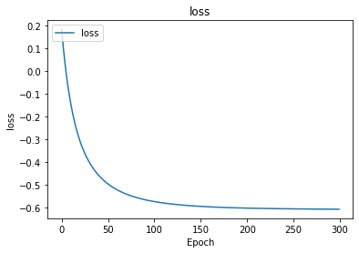


```python
# why softplus? 
t = np.arange(-5., 5., 0.1)
plt.plot(t, np.log(1+np.exp(t)), 'g-')
```


    [<matplotlib.lines.Line2D at 0x7ff77014c710>]


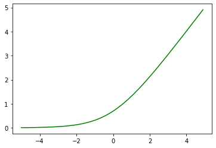


### Ex 2 
#### (a) Extend the previous exercise to a two dimensional input $(x_1, x_2)$ with two variances $(\sigma_1^2, \sigma_2^2)$.

#### We assume that the input variables are not correlated.

#### (b) Similar to the exercise above (gradient-based learning), design a neural network that learns the 3 means of a gaussian mixture with 3 components 

*   Assume $x$ is one dimensional
*     $ p(y\|x) $   is a gaussian mixture of three components 
*   Assume that the three components are equally likely
*   Assume all variances are 1 


```

```

### Hidden units 


Sigmoid vs. Hyperbolic


```python
import numpy as np
import matplotlib.pyplot as plt

t = np.arange(-5., 5., 0.1)
plt.plot(t, np.tanh(t), 'g-', label='tanh')
plt.plot(t, 1/(1+np.exp(-t)), 'b-', label='sigmoid')
plt.legend()
```


    <matplotlib.legend.Legend at 0x7ff770129dd8>


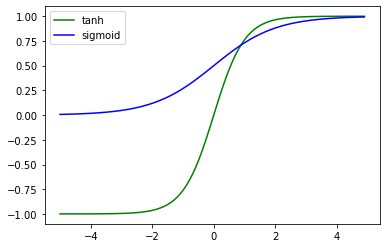


Absolute value rectifier unit


```python
import numpy as np
import matplotlib.pyplot as plt

t1 = np.arange(-5., 0.1, 0.1)
t2 = np.arange(0, 5, 0.1)
plt.plot(t1, -t1, 'g-', t2, t2, 'b-')
```


    [<matplotlib.lines.Line2D at 0x7ff77009cf60>,
     <matplotlib.lines.Line2D at 0x7ff7700aa0b8>]


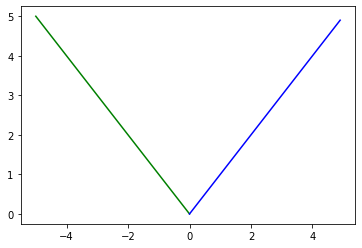


##Backprop

Let's reconsider the problem of learning the variance, and implement gradient-based learning from scratch without recurring to Keras. It means that we have to implement forward prop and backprop. 

Loss function: 
$- log \beta + \beta (y -\mu)^2 $ 

Forward propagation: 
$$a = w x + b $$
$$ \beta = relu (a) $$
$$ L = - log \beta + \beta (y -\mu)^2 $$

Backward propagation: 
$$ \frac {\delta L } {\delta \beta} = -\frac{1}{\beta} + (y-\mu)^2  $$ 


$$ \frac {\delta L } {\delta a} =  
\begin{cases}
      \frac {\delta L } {\delta \beta} * 1  & if a > 0 \\
     \frac {\delta L } {\delta \beta} * 0 & if a < 0 \\
\end{cases}      $$


$$ \frac{\delta L } {\delta w} = \frac {\delta L } {\delta a}  x  $$ 


$$ \frac{\delta L } {\delta b} = \frac {\delta L } {\delta a} 1   $$ 


```python
import math
import numpy as np 

w = 0.01 # initial w 
b = 0 # initial b 
x = 1 # input to conition on 
sigma = math.sqrt(10) # std deviation of the conditional distribution p(y|x=1)
mu = 0 # for simplicity, we take mu = 0 
true_beta = 1 / sigma**2 # true precision to guess 
eps = 0.0001 # learnign rate 
y = np.random.normal(0, sigma, 1000) # sample y from the Gaussian to use as labels 
# y
```


```python
# implement forward propagarion 

def forward (w,b): 
  a = w * x + b 
  beta = np.maximum (a, 0)
  L = -np.log(beta) + beta * sum ( (y-mu)**2  ) /len(y) 
  return a, beta, L 

# implement backward propagarion 

def backward(beta, a):
  delta_L_to_beta =  -1/beta + sum ( (y - mu)**2 ) / len (y)  
  if a > 0: 
    delta_L_to_a = delta_L_to_beta
  else: 
    delta_L_to_a = 0
  delta_L_to_w = delta_L_to_a * x 
  delta_L_to_b = delta_L_to_a 
  return delta_L_to_w, delta_L_to_b 

# implement gradient descent
print('w \t\t\t b \t\t\t a \t\t beta \t\t true_beta')
for i in range(1000): 
  a, beta, L = forward (w,b) 
  if i%100==0: 
    print (w, b, a, beta, true_beta)
  delta_L_to_w, delta_L_to_b = backward(beta, a) 
  w = w - eps * delta_L_to_w
  b = b - eps * delta_L_to_b


```

    w 			 b 			 a 		 beta 		 true_beta
    0.01 0 0.01 0.01 0.09999999999999998
    0.0523793852703444 0.0423793852703444 0.09475877054068879 0.09475877054068879 0.09999999999999998
    0.05446046083942835 0.04446046083942835 0.09892092167885669 0.09892092167885669 0.09999999999999998
    0.054718267549679574 0.04471826754967957 0.09943653509935915 0.09943653509935915 0.09999999999999998
    0.05475158042935688 0.044751580429356876 0.09950316085871375 0.09950316085871375 0.09999999999999998
    0.054755907453349364 0.04475590745334936 0.09951181490669872 0.09951181490669872 0.09999999999999998
    0.054756469870038814 0.04475646987003881 0.09951293974007763 0.09951293974007763 0.09999999999999998
    0.05475654297805371 0.04475654297805371 0.09951308595610742 0.09951308595610742 0.09999999999999998
    0.05475655248140337 0.04475655248140337 0.09951310496280674 0.09951310496280674 0.09999999999999998
    0.05475655371675065 0.04475655371675065 0.09951310743350131 0.09951310743350131 0.09999999999999998


#### The problem with Relu

The network with Relu can step into regions where log is not defined 

It needs good initialization and very small learning step

For example, consider for instance the case where w = 0.1, the gradient step can easily project the b into the infeasible region 


```python


import matplotlib.pyplot as plt
fig = plt.figure(figsize=(10,10))

baxis = np.linspace(0.00000001, 0.1, 100)

a, beta, L = forward(0.1 * np.ones(baxis.shape),  baxis)
plt.plot(baxis, L, 'g-', label='w=0.1' )
a, beta, L = forward(0.05 * np.ones(baxis.shape),  baxis)
plt.plot(baxis, L, 'b-', label='w=0.05' )
a, beta, L = forward(0.01 * np.ones(baxis.shape),  baxis)
plt.plot(baxis, L, 'r-', label='w=0.01' )

fig.gca().set_title("$Loss (b)$", position=(0.5,0.9))
plt.legend()


```


    <matplotlib.legend.Legend at 0x7ff7700aaf60>


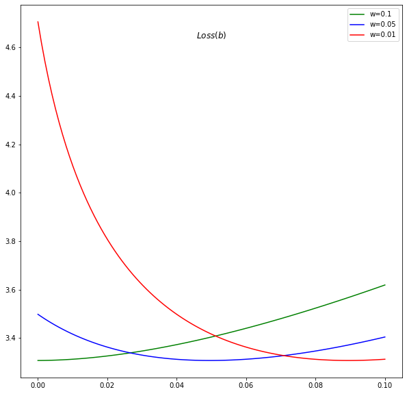


#### Why softmax would work?

We plot the loss function in terms of w and b when using the softplus activation


```python
import numpy as np 
import matplotlib.pyplot as plt
from mpl_toolkits.mplot3d import Axes3D
%matplotlib inline 

x = 1
mu = 0 

fig = plt.figure(figsize=(27,9))

def forward (theta, y):
  a = theta[0] * x + theta[1] 
  beta = np.log(1+np.exp(a)) # softplus
  L = -np.log(beta) + beta * (sum (y-mu)**2 /len(y)) 
  return L 

waxis = np.linspace(-10, 10, 100)
baxis = np.linspace(-10, 10, 100)
X, Y = np.meshgrid(waxis, baxis)
C = np.c_[(X.ravel(), Y.ravel())]


## Normal case: sigma is of moderate value
sigma = math.sqrt(10)
true_beta = 1 / sigma**2 
y = np.random.normal(0, sigma, 1000) 

L = np.array([forward (C[i], y) for i in range (len(C))])
L = L.reshape(X.shape)

ax = fig.add_subplot(131, projection='3d')
ax.plot_surface(X,Y,L)
ax.set_xlabel('$w$')
ax.set_ylabel('$b$')
ax.set_zlabel('$Loss$')
# ax.set_xlim(-10,10)
# ax.set_ylim(10,-10)
ax.set_title('$L_{softmax}(w,b)$')


## Extreme case: sigma very high 
sigma = 10000 
true_beta = 1 / sigma**2 
y = np.random.normal(0, sigma, 1000) 

L = np.array([forward (C[i], y) for i in range (len(C))])
L = L.reshape(X.shape)

ax = fig.add_subplot(132, projection='3d')
ax.plot_surface(X,Y,L)
ax.set_xlabel('$w$')
ax.set_ylabel('$b$')
ax.set_zlabel('$Loss$')
# ax.set_xlim(-10,10)
# ax.set_ylim(10,-10)
ax.ticklabel_format(style='plain')


ax.set_title('$L_{softmax}(w,b)$  \n notice the sharp descent / z-axis scale' )

## Extreme case: sigma very low 
sigma = 10**-4 
true_beta = 1 / sigma**2 
y = np.random.normal(0, sigma, 1000) 

L = np.array([forward (C[i], y) for i in range (len(C))])
L = L.reshape(X.shape)

ax = fig.add_subplot(133, projection='3d')
ax.plot_surface(X,Y,L)
ax.set_xlabel('$w$')
ax.set_ylabel('$b$')
ax.set_zlabel('$Loss$')
# ax.set_xlim(-10,10)
# ax.set_ylim(10,-10)

ax.set_title('$L_{softmax}(w,b)$  \n notice the slow descent / z-axis scale' )

```


    Text(0.5, 0.92, '$L_{softmax}(w,b)$  \n notice the slow descent / z-axis scale')


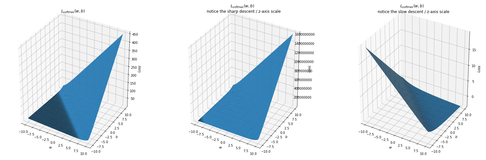


### Ex 3 
(a) Implement backward propagation and gradient descent for the example with softplus 

(b) Implement forward propagation, backprop and gradient descent for part a) or part b) of Ex 2. (You choose).


```


```


## *Assignment 6*: Regularization

Notebook: [Regularization](exercises/CMPS_392_Asst_6_Regularization.ipynb)

---

## Ex 1
### Data Augmentation 
In this experiment we aim to classify grocery images. In the same time, it is a first pytorch tutorial, maybe you will like it even more than tensorflow or keras! 

We also will experiment with transfer learning since we will use a pretrained network and only change its output layer!

Show that data augmentation using image transormations improves the generalization performance (testing loss - training loss) of our classifier 

In pytorch, it is easy to inject random data transformation using the torchvision.transforms module 

Try as much transformations as you like and report with your remarks

Reference: https://pytorch.org/docs/stable/torchvision/transforms.html


```
# run only one time to download the dataset 
! git clone https://github.com/marcusklasson/GroceryStoreDataset.git
```

    Cloning into 'GroceryStoreDataset'...
    remote: Enumerating objects: 6553, done.
    remote: Total 6553 (delta 0), reused 0 (delta 0), pack-reused 6553
    Receiving objects: 100% (6553/6553), 116.24 MiB | 41.15 MiB/s, done.
    Resolving deltas: 100% (313/313), done.


```python
import os
import random
import PIL.Image
import numpy as np 
import matplotlib.pyplot as plt 

images_path=[]
labels=[]
for dir, subdir, files in os.walk("/content/GroceryStoreDataset/dataset/train/"):
    # print (files)
    for file in files:        
        images_path.append(os.path.join(dir, file))
        labels.append(dir.split('/')[-1])
       
print (len(labels))
print (len(set(labels)))

```

    2640
    81


```python
x, y = random.sample( list ( zip(images_path, labels) ), 1)[0]
im = PIL.Image.open(x)
display(im)
print(y) 
```


    Arla-Natural-Yoghurt


```python
import torch
from torchvision import datasets, transforms, models
from torch.utils.data import Dataset, DataLoader

class GroceryDataset(Dataset):
    def __init__(self, root, transform=None):
        self.images_path=[]
        self.labels=[]
        for dir, subdir, files in os.walk(root):
          for file in files:
            self.images_path.append(os.path.join(dir, file))
            self.labels.append(dir.split('/')[-1])
        self.transform = transform
        self.classes = dict ( [ (y,x) for (x,y) in enumerate ( set (self.labels) )  ] ) # no for loops
        # classes ["Arla-Natural-Yoghurt"] = 33 


    def __len__(self):
        return len(self.labels)

    def __getitem__(self, idx):
        
        target = self.classes [ self.labels[idx] ] 
        im = PIL.Image.open(self.images_path[idx])
        if self.transform:
          im = self.transform(im)
        else: 
          im = transforms.ToTensor()(im)


        return im, target

# data augmentation can be controlled here by adding some random transformations 
transform_ = transforms.Compose([
    transforms.Resize((224,224)),
    # add some random transformations ??
    # rotate the picture, remove parts of the lectures, add some noise // data augmenation 
    
    transforms.ToTensor(),
    # nromalize given means and std deviations 
    transforms.Normalize((0.4914, 0.4822, 0.4465), (0.2023, 0.1994, 0.2010)),
])

# data augmentation is only used for training, we do not augment the test data 
# But to raise the challenge maybe you can inject a transformation to the test set
transform_test = transforms.Compose([
    transforms.Resize((224,224)),
    # nromalize given means and std deviations 
    transforms.Normalize((0.4914, 0.4822, 0.4465), (0.2023, 0.1994, 0.2010)),
])


data =  GroceryDataset(root="/content/GroceryStoreDataset/dataset/train/", transform=transform_)
loader = torch.utils.data.DataLoader(data, batch_size=64, shuffle=True)

testdata =  GroceryDataset(root="/content/GroceryStoreDataset/dataset/test/", transform=transform_test)
testloader = torch.utils.data.DataLoader(data, batch_size=64, shuffle=True)

# for i in range (3): 
#   for x, y in loader: 
#     print (x.shape, y) 
print (len(data.classes))
print (len(testdata.classes))

```

    81
    81


```python
# if it prints cpu, runtime -> change runtime type -> Hardware accelerator -> select gpu
device = torch.device("cuda:0" if torch.cuda.is_available() else "cpu")
print (device)
```

    cuda:0


```python
from torch import nn
from torch import optim


# take the alexnet neural network and change the last layer 
model = models.alexnet(pretrained=True)
print (model.classifier[6])
model.classifier[6]= nn.Sequential(
    nn.Linear(in_features=4096, out_features=len(data.classes)),
    nn.LogSoftmax(dim=1) ) 

criterion = nn.NLLLoss()

# we just optimize with respect to the last layer weights and biases! 
optimizer = optim.Adam(model.classifier[6].parameters(), lr=0.003)

model.to(device)
model
```

    Linear(in_features=4096, out_features=1000, bias=True)


    AlexNet(
      (features): Sequential(
        (0): Conv2d(3, 64, kernel_size=(11, 11), stride=(4, 4), padding=(2, 2))
        (1): ReLU(inplace=True)
        (2): MaxPool2d(kernel_size=3, stride=2, padding=0, dilation=1, ceil_mode=False)
        (3): Conv2d(64, 192, kernel_size=(5, 5), stride=(1, 1), padding=(2, 2))
        (4): ReLU(inplace=True)
        (5): MaxPool2d(kernel_size=3, stride=2, padding=0, dilation=1, ceil_mode=False)
        (6): Conv2d(192, 384, kernel_size=(3, 3), stride=(1, 1), padding=(1, 1))
        (7): ReLU(inplace=True)
        (8): Conv2d(384, 256, kernel_size=(3, 3), stride=(1, 1), padding=(1, 1))
        (9): ReLU(inplace=True)
        (10): Conv2d(256, 256, kernel_size=(3, 3), stride=(1, 1), padding=(1, 1))
        (11): ReLU(inplace=True)
        (12): MaxPool2d(kernel_size=3, stride=2, padding=0, dilation=1, ceil_mode=False)
      )
      (avgpool): AdaptiveAvgPool2d(output_size=(6, 6))
      (classifier): Sequential(
        (0): Dropout(p=0.5, inplace=False)
        (1): Linear(in_features=9216, out_features=4096, bias=True)
        (2): ReLU(inplace=True)
        (3): Dropout(p=0.5, inplace=False)
        (4): Linear(in_features=4096, out_features=4096, bias=True)
        (5): ReLU(inplace=True)
        (6): Sequential(
          (0): Linear(in_features=4096, out_features=81, bias=True)
          (1): LogSoftmax()
        )
      )
    )


```python
epochs = 10
steps = 0
running_loss = 0


for epoch in range(epochs):
  for inputs, labels in loader:
      # print (inputs.shape)
      steps += 1
      # Move input and label tensors to the default device
      inputs= inputs.to(device)
      labels = labels.to(device)
      optimizer.zero_grad()
      logps = model.forward(inputs)
      loss = criterion(logps, labels)
      loss.backward()
      optimizer.step()
      running_loss += loss.item()
  print(f"Epoch {epoch+1}/{epochs}.. "
      f"Train loss: {running_loss/len(loader):.3f}.. ")
  running_loss = 0
          

test_loss = 0
test_accuracy = 0
model.eval()
with torch.no_grad():
    for inputs_test, labels_test in testloader:
        inputs_test, labels_test = inputs_test.to(device), labels_test.to(device)
        logps_test = model.forward(inputs_test)
        batch_loss = criterion(logps_test, labels_test)
        test_loss += batch_loss.item()
        # Calculate accuracy
        ps = torch.exp(logps_test)
        top_p, top_class = ps.topk(1, dim=1)
        equals = top_class == labels_test.view(*top_class.shape)
        test_accuracy += torch.mean(equals.type(torch.FloatTensor)).item()

print(
      f"Test loss: {test_loss/len(testloader):.3f}.. "
      f"Test accuracy: {test_accuracy/len(testloader):.3f}")

model.train();


```

    Epoch 1/10.. Train loss: 1.778.. 
    Epoch 2/10.. Train loss: 0.415.. 
    Epoch 3/10.. Train loss: 0.307.. 
    Epoch 4/10.. Train loss: 0.240.. 
    Epoch 5/10.. Train loss: 0.188.. 
    Epoch 6/10.. Train loss: 0.157.. 
    Epoch 7/10.. Train loss: 0.208.. 
    Epoch 8/10.. Train loss: 0.189.. 
    Epoch 9/10.. Train loss: 0.141.. 
    Epoch 10/10.. Train loss: 0.151.. 
    Test loss: 0.085.. Test accuracy: 0.972


## Ex 2
### Adversarial training 
In this experiment we generate adversarial images for the grocery dataset and the model that we just learned using a library called foolbox https://github.com/bethgelab/foolbox

Augmenting the original dataset by these adversarial samples helps the regularization of the training model. Use the following skeleton code to generate adversarial samples, add them to the original dataset and comment on your findings in terms of training and testing accuracy. 


```
# ! pip install foolbox
```


```python
import random, os
import foolbox as fb
import PIL.Image
import torch
from torchvision import datasets, transforms, models
from torch import nn

device = torch.device("cuda:0")
images_path=[]
labels=[]
for dir, subdir, files in os.walk("/content/GroceryStoreDataset/dataset/train/Packages"):
    # print (files)
    for file in files:        
        images_path.append(os.path.join(dir, file))
        labels.append(dir.split('/')[-1])

classes = dict ( [ (y,x) for (x,y) in enumerate ( set (labels) )  ] ) 

ims = [] 
ys = [] 
first = True 
for (x, y) in random.sample( list ( zip(images_path, labels) ), 2):
  y = classes[y]
  im = PIL.Image.open(x)
  im = transforms.Resize((224,224))(im)
  if (first) :
    display(im)
    first = False 
  im = transforms.ToTensor()(im)
  ims.append(im) 
  ys.append(torch.tensor(y))


# print(ys) 
# print (torch.stack(ims).shape)
# print (torch.stack(ys).shape)

# to test separately from the model learned in Ex 1:
# model = models.alexnet(pretrained=True)
# print (model.classifier[6])
# model.classifier[6]= nn.Linear(in_features=4096, out_features=len(set(labels))) 
# model.to(device) 

preprocessing = dict(mean=[0.4914, 0.4822, 0.4465], std=[0.2023, 0.1994, 0.2010], axis=-3)
fmodel = fb.PyTorchModel(model.eval(), bounds=(0, 1), preprocessing=preprocessing)
attack = fb.attacks.FGSM()
# bigger epsilons lead to more corruption in the image 
epsilons = [0.01]
_, advs, success = attack(fmodel, torch.stack(ims).to(device), torch.stack(ys).to(device), epsilons=epsilons)

print (success)
for x in advs: 
  logps= model.forward(x) 
  ps = torch.exp(logps)
  top_p, top_class = ps.topk(1, dim=1)
  print ("adv classes: ", top_class)
  print ("true classes: ", ys)
  im = transforms.ToPILImage()(x[0].to("cpu"))
  display(im)   
  im = transforms.ToPILImage()(x[1].to("cpu"))
  # display(im) 

```


    tensor([[True, True]], device='cuda:0')
    adv classes:  tensor([[75],
            [75]], device='cuda:0')
    true classes:  [tensor(28), tensor(3)]


## Ex 3
### Noise Robustness vs. dropout in the special case of linear regression

(a) Show that adding Gaussian noise with **small** magnitude to the weights and biases of linear regression (the noise has mean $0$ and variance $\eta << 1$) does not affect the solution of the gradient descent. 

(b) Another way of attempting regularization is by adding a dropout layer. Comment on the feasibility and the impact of this approach for the current scenario.


```python
import torch
from torch import nn 
device = torch.device("cuda:0" if torch.cuda.is_available() else "cpu")
# A x = b 
A = torch.rand(10,3)
A1 = torch.cat ( (A , torch.ones (10,1)), 1 ) 
sol = torch.rand(4,1) 
b = torch.matmul(A1, sol) 
# A1,A,b,
sol
```


    tensor([[0.5491],
            [0.4450],
            [0.0859],
            [0.6499]])


```python
# without adding noise 
model = nn.Linear(in_features=3, out_features=1)
model.to(device)

criterion = torch.nn.MSELoss() 
optimizer = torch.optim.SGD(model.parameters(), lr = 0.05)

epochs = 1000

inputs= A.to(device)
labels = b.to(device)


for epoch in range(epochs):
  optimizer.zero_grad()
  preds = model.forward(inputs)
  loss = criterion(preds, labels)

  loss.backward()
  optimizer.step()


model.eval()
preds = model.forward(inputs)
loss = criterion(preds, labels)
print (loss) 
model.train() 

print (model.bias)
print (model.weight)

```

    tensor(1.3726e-06, device='cuda:0', grad_fn=<MseLossBackward>)
    Parameter containing:
    tensor([0.6465], device='cuda:0', requires_grad=True)
    Parameter containing:
    tensor([[0.5496, 0.4467, 0.0899]], device='cuda:0', requires_grad=True)


## Ex 4
### L2 regularization vs. L1 regularization 
(a) Based on the data provided below, design an experiment to show the difference between the solutions to three **logistic regression** problems:  


1.   the cost function is cross-entropy 
2.   the cost function is cross-entropy + L2 regularization 
3.   the cost function is cross-entropy + L1 regularization 


(b) In the three cases (no regularization, L2 regularization and L1 regularization), compare the weights of the first layer with respect to the variances of the corresponding features and the co-variances of these features w.r.t the label

(c) Show that early stopping is equivalent to L2 regularization for some decay coefficient $\alpha$ 


---


*N.b. some of the code and the data file belong to https://github.com/udacity/deep-learning-v2-pytorch/tree/master/intro-neural-networks/gradient-descent*


*Preferably use Pytorch, but it is not mandatory*


```
! wget https://raw.githubusercontent.com/udacity/deep-learning-v2-pytorch/master/intro-neural-networks/gradient-descent/data.csv
```

    --2020-04-13 23:16:16--  https://raw.githubusercontent.com/udacity/deep-learning-v2-pytorch/master/intro-neural-networks/gradient-descent/data.csv
    Resolving raw.githubusercontent.com (raw.githubusercontent.com)... 151.101.0.133, 151.101.64.133, 151.101.128.133, ...
    Connecting to raw.githubusercontent.com (raw.githubusercontent.com)|151.101.0.133|:443... connected.
    HTTP request sent, awaiting response... 200 OK
    Length: 1778 (1.7K) [text/plain]
    Saving to: ‘data.csv’
    
    data.csv            100%[===================>]   1.74K  --.-KB/s    in 0s      
    
    2020-04-13 23:16:16 (21.6 MB/s) - ‘data.csv’ saved [1778/1778]
    


```python

import matplotlib.pyplot as plt
import numpy as np
import pandas as pd

#Some helper functions for plotting and drawing lines

def plot_points(X, y):
    admitted = X[np.argwhere(y==1)]
    rejected = X[np.argwhere(y==0)]
    plt.scatter([s[0][0] for s in rejected], [s[0][1] for s in rejected], s = 25, color = 'blue', edgecolor = 'k')
    plt.scatter([s[0][0] for s in admitted], [s[0][1] for s in admitted], s = 25, color = 'red', edgecolor = 'k')

def display(m, b, color='g--'):
    plt.xlim(-0.05,1.05)
    plt.ylim(-0.05,1.05)
    x = np.arange(-10, 10, 0.1)
    plt.plot(x, m*x+b, color)

data = pd.read_csv('/content/data.csv', header=None)
X = np.array(data[[0,1]])
y = np.array(data[2])
plot_points(X,y)
plt.show()
```


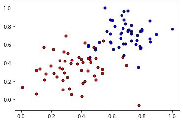


## *Assignment 7*: Optimization

Coming soon 

## *Assignment 8*: Convolutionl Neural Networks (CNN)

Coming soon 

## *Assignment 9*: Recurrent Neural Networks (RNN) 

Coming soon 

## Multi-choice questions: Test your deep learning knowledge

[Test Your Skills](MCQ/bank.pdf)

## Competition 

In the context of the Spring 2020 class offering, we have organized an in-class kaggle competition under the theme: **Android Malware Classification**. 

[You can still have a late submission](https://www.kaggle.com/c/aub-cmps-392)

### Winners solutions: 

1. [Houdeib & Haidar](https://github.com/mhamadhdeib/Android-Malware-Classification)
2. [Tachanka](https://drive.google.com/open?id=1_WvXiHlUHJe4-ZHdsvJuZagDzVdIwWVw)


## Contributions 

If you would like to contribute to this guide/handbook, please contact the author at `mn115 at aub.edu.lb` 


## Citation 
To cite this _handbook_, please use this bibtex entry:
```bibtex
@book{nassar-2020,
    title={Deep Learning Handbook},
    author={Mohamed Nassar},
    publisher={GitHub Pages},
    note={\url{http://mnassar.github.io/deeplearninghandbook}},
    year={2020}
}
```
